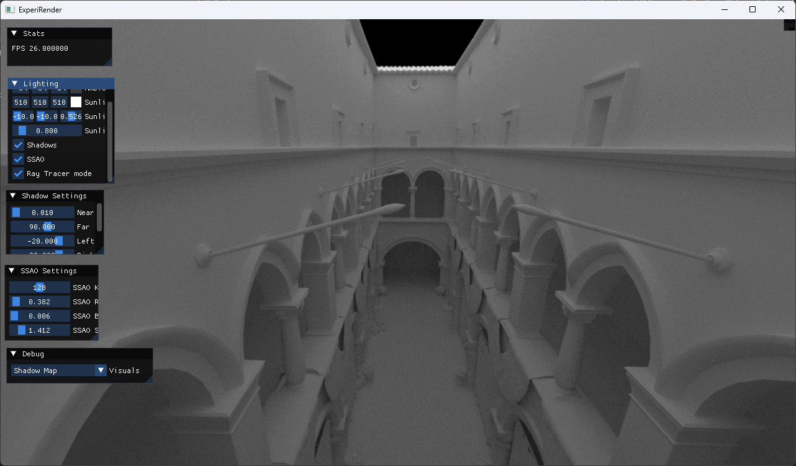
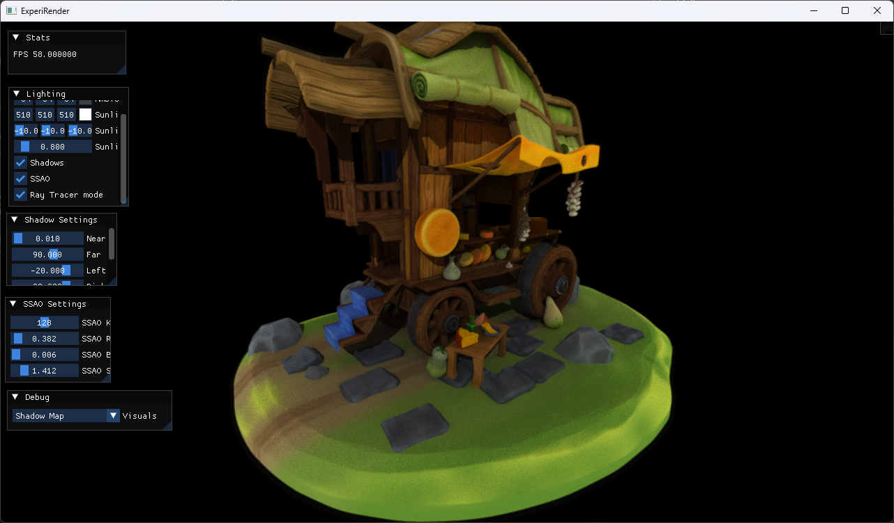

# ExperiRender

A Graphics Renderer written in Vulkan mainly for visualization purposes required in research fields. Current iteration has support for: 

- Shadow Maps 
- Screen Space Ambient Occlusion (SSAO) 
- Mipmaps 
- Blinn-phong lighting support for
    - textures (normal maps, roughness maps) 
    - metallic materials.
- Ray Tracing pipeline for,
    - Shadows
    - Ambient Occlusion (AO)

Currently Working on:

- Ray Tracing pipeline for,
    - Texture, metallic materials, PBR
    - Reflections
- Screen Space Reflections
- Parallax Mapping

## Showcase

Showcase | Details
---------|--------
  | Ray Traced Geometry, AO  Implements gltf geometry loaded with ray tracing using Vulkan Ray Tracing extensions.
 | Ray Traced Shadows and Vertex Colors  Implements shadows using ray tracing and shading using vertex colors.

Dependencies Required:

- [Vulkan SDK 1.3](https://vulkan.lunarg.com/sdk/home)
- [SDL](https://github.com/libsdl-org/SDL)
- [GLFW](https://github.com/glfw/glfw)
- [GLM](https://github.com/g-truc/glm)
- [VK-Bootstrap](https://github.com/charles-lunarg/vk-bootstrap)
- [VMA](https://github.com/GPUOpen-LibrariesAndSDKs/VulkanMemoryAllocator)
- [Volk](https://github.com/zeux/volk)
- [FastGLTF](https://github.com/spnda/fastgltf)
- [DearImGui](https://github.com/ocornut/imgui)

