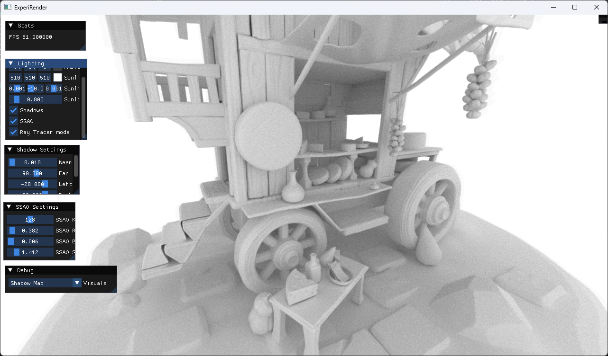
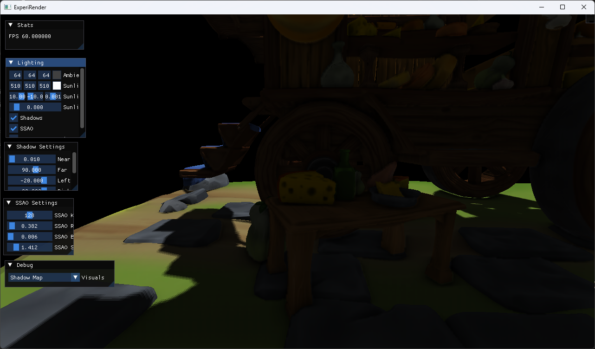
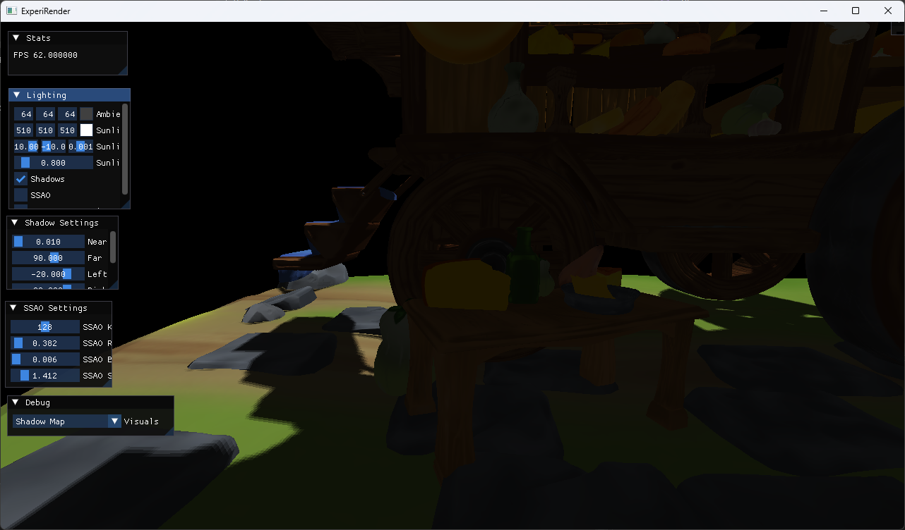

# ExperiRender

A Graphics Renderer written in Vulkan mainly for visualization purposes required in research fields. Current iteration has support for rasterization and ray tracing. 

- Rasterizer
    - Shadow Maps 
    - Screen Space Ambient Occlusion (SSAO) 
    - Mipmaps 
    - Blinn-phong lighting 
- Hardware Ray Tracing

Currently Working on:

- Ray Tracing pipeline for,
    - PBR materials
    - Reflections
- Screen Space Reflections in Rasterizer
- Parallax Mapping for Rasterizer and Raytracer

## Showcase

Showcase | Details
---------|--------
 | <b> Ray Traced Geometry, AO </b>  Implements gltf geometry loaded with ray tracing using Vulkan Ray Tracing extensions.
  | <b> Screen Space Ambient Occlusion </b>  Implements screen space ambient occlusion.
 | <b> Shadow Maps </b>  Implements shadow mapping.

## Models Used

Model - ["The Traveling Wagon - Cheeeeeeeeeese"](https://sketchfab.com/3d-models/the-traveling-wagon-cheeeeeeeeeese-d9761a00e1f34d7ab4e83cc92e94d6f3) by [Sophie Becker](https://sketchfab.com/sophiebecker) licensed under [CC-BY-4.0](http://creativecommons.org/licenses/by/4.0/)

## Dependencies Required:

- [Vulkan SDK 1.3](https://vulkan.lunarg.com/sdk/home)
- [SDL](https://github.com/libsdl-org/SDL)
- [GLFW](https://github.com/glfw/glfw)
- [GLM](https://github.com/g-truc/glm)
- [VK-Bootstrap](https://github.com/charles-lunarg/vk-bootstrap)
- [VMA](https://github.com/GPUOpen-LibrariesAndSDKs/VulkanMemoryAllocator)
- [Volk](https://github.com/zeux/volk)
- [FastGLTF](https://github.com/spnda/fastgltf)
- [DearImGui](https://github.com/ocornut/imgui)
- [spdlog](https://github.com/gabime/spdlog)

