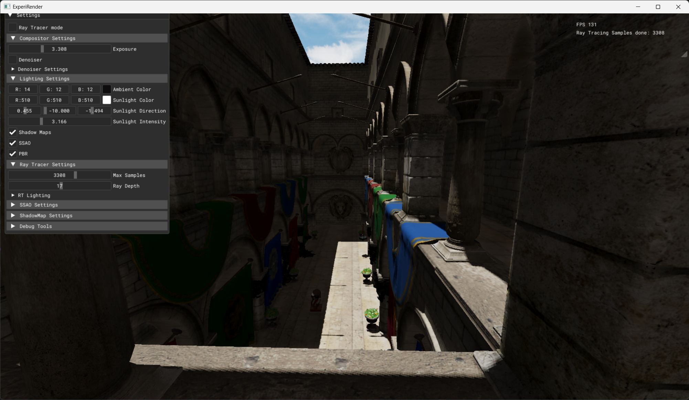
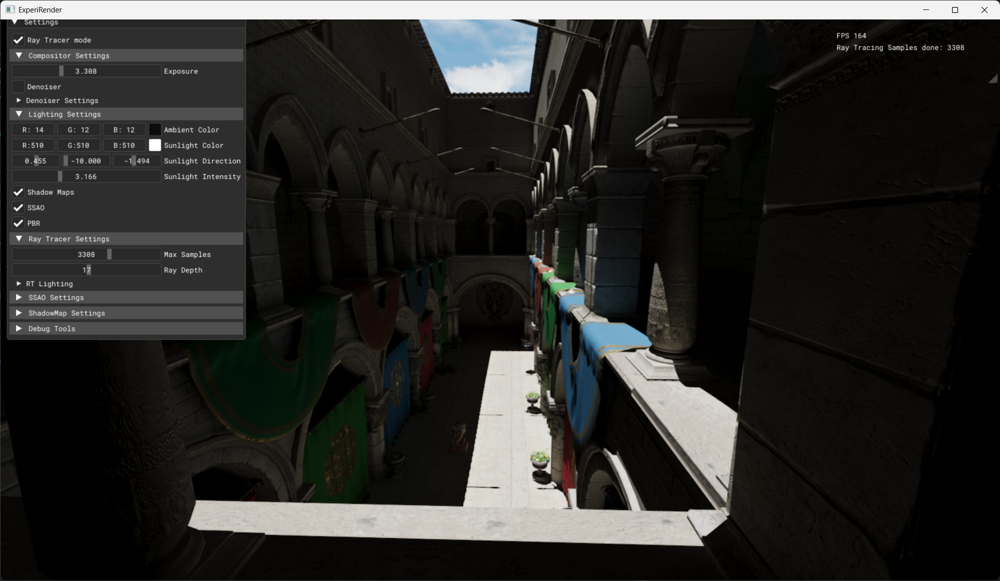

# ExperiRender

<table>
  <tr>
    <td></td>
    <td></td>
  </tr>
  <tr>
    <td align="center">Raster Render</td>
    <td align="center">Raytraced Render</td>
  </tr>
</table>

A cross-platform Graphics Renderer written in Vulkan mainly for visualization purposes required in research fields. Current iteration has support for rasterization and ray tracing. 

- Rasterizer
    - Shadow Maps 
    - Screen Space Ambient Occlusion (SSAO) 
    - Mipmaps 
    - Environment Maps (HDRI)
    - PBR
- Hardware Ray Tracing
    - PBR
    - Shadows

# Build

[](https://github.com/prathikkaranth/ExperiRender/actions)

Build system should work for windows and linux based systems. Build configuration currently tested for Windows 11 (x64) and Ubuntu 24.04 (Noble Numbat)

_Note: Non NVIDIA RTX cards could potentially give errors for the raytracer_

## Linux

1. Install the [Vulkan SDK](https://vulkan.lunarg.com/doc/view/latest/linux/getting_started_ubuntu.html)
```bash
wget -qO- https://packages.lunarg.com/lunarg-signing-key-pub.asc | sudo tee /etc/apt/trusted.gpg.d/lunarg.asc
sudo wget -qO /etc/apt/sources.list.d/lunarg-vulkan-noble.list http://packages.lunarg.com/vulkan/lunarg-vulkan-noble.list
sudo apt update
sudo apt install vulkan-sdk
```

2. Install SDL 2.0
```bash
sudo apt install libsdl2-2.0-0 libsdl2-dev libsdl-image1.2-dev libsdl1.2-dev
```

3. Clone repository
```
git clone https://github.com/prathikkaranth/ExperiRender.git
```

4. Build using CMake

```bash
mkdir build && cd build
cmake ..
make
```

## Windows

_Instructions tested on Visual Studio 2022_

1. Download and Install the [Vulkan SDK](https://vulkan.lunarg.com/sdk/home#windows) in your C: drive root (important for shader compilation). Add the installed sdk directory in your environment variables.

2. Clone repository
```
git clone https://github.com/prathikkaranth/ExperiRender.git
```

3. Build using CMake
```cmd
mkdir build
cd build
cmake .. -G "Visual Studio 17 2022" -A x64
cmake --build . --config Release
```

### Custom Assets

Custom assets can be drag and dropped to the window. Drag and drop feature currently supports .gltf, .glb and .hdr files.


## Models Used for Showcase

- [Sponza](https://github.com/KhronosGroup/glTF-Sample-Models/tree/main/2.0/Sponza)
- [Flight Helmet](https://github.com/KhronosGroup/glTF-Sample-Models/tree/main/2.0/FlightHelmet)

## Dependencies:

- [Vulkan SDK 1.3](https://vulkan.lunarg.com/sdk/home)
- [SDL](https://github.com/libsdl-org/SDL)
- [GLM](https://github.com/g-truc/glm)
- [VK-Bootstrap](https://github.com/charles-lunarg/vk-bootstrap)
- [VMA](https://github.com/GPUOpen-LibrariesAndSDKs/VulkanMemoryAllocator)
- [FastGLTF](https://github.com/spnda/fastgltf)
- [DearImGui](https://github.com/ocornut/imgui)
- [spdlog](https://github.com/gabime/spdlog)
- [JSON](https://json.nlohmann.me/)


